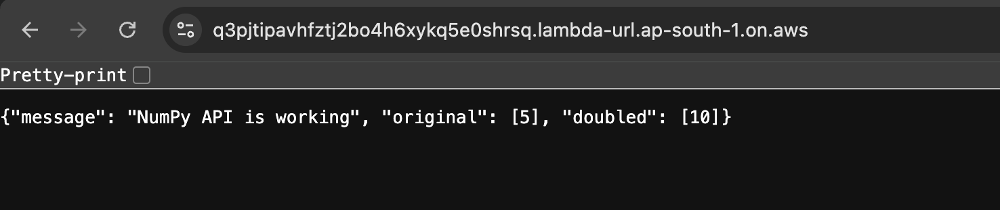
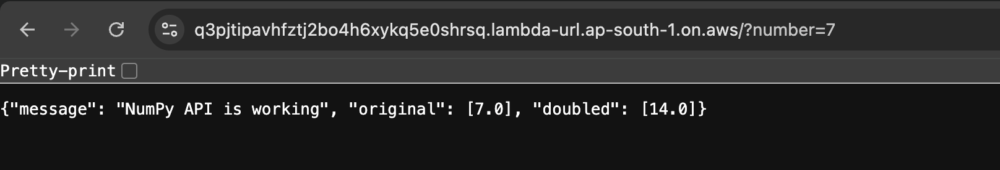

# AWS Lambda + NumPy API (Using Existing Pandas Layer)

URL - https://q3pjtipavhfztj2bo4h6xykq5e0shrsq.lambda-url.ap-south-1.on.aws/ 

## 1. Objective

The goal of this task was to run NumPy operations inside AWS Lambda by reusing the existing Pandas Docker-built layer, which already contains NumPy.
A simple API endpoint was created that accepts an optional query parameter and returns NumPy-calculated results in JSON format.

This workflow represents the final approach that works reliably end-to-end.

## 2. Why We Can Use the Pandas Layer for NumPy

NumPy is already bundled inside the Pandas layer because Pandas depends on NumPy.
So, no new layer needs to be built.

## 3. Create Lambda Function

Step 1 — Create a new function:

Name: numpy-aman-api

Runtime: Python 3.10

## 4. Attach Existing Pandas Layer

AWS Console → Lambda → Layers → Add layer
Choose:

Custom Layers → pandas-layer-docker

Runtime: Python 3.10

Now NumPy becomes available inside the Lambda execution environment.

## 5. Lambda Function Code

import json
import numpy as np

def lambda_handler(event, context):
    try:
        params = event.get("queryStringParameters") or {}
        number_str = params.get("number")

        if number_str is None:
            number = 5
        else:
            number = float(number_str)

        arr = np.array([number])
        doubled = arr * 2

        return {
            "statusCode": 200,
            "headers": {"Content-Type": "application/json"},
            "body": json.dumps({
                "message": "NumPy API is working",
                "original": arr.tolist(),
                "doubled": doubled.tolist()
            })
        }

    except Exception as e:
        return {
            "statusCode": 500,
            "headers": {"Content-Type": "application/json"},
            "body": json.dumps({
                "error": f"Internal error: {str(e)}"
            })
        }

## 6. Create API Endpoint (Function URL)

Enable Function URL:

Auth: NONE (public)

Copy the generated URL and test it.

Example format:

https://xxxxxxxx.lambda-url.ap-south-1.on.aws/

## Output

A) Default output (no query param)

https://q3pjtipavhfztj2bo4h6xykq5e0shrsq.lambda-url.ap-south-1.on.aws/

Expected result:

B) Output using query param ?number=7
https://q3pjtipavhfztj2bo4h6xykq5e0shrsq.lambda-url.ap-south-1.on.aws/?number=7

C) Output with wrong query param
https://q3pjtipavhfztj2bo4h6xykq5e0shrsq.lambda-url.ap-south-1.on.aws/?number=abc

